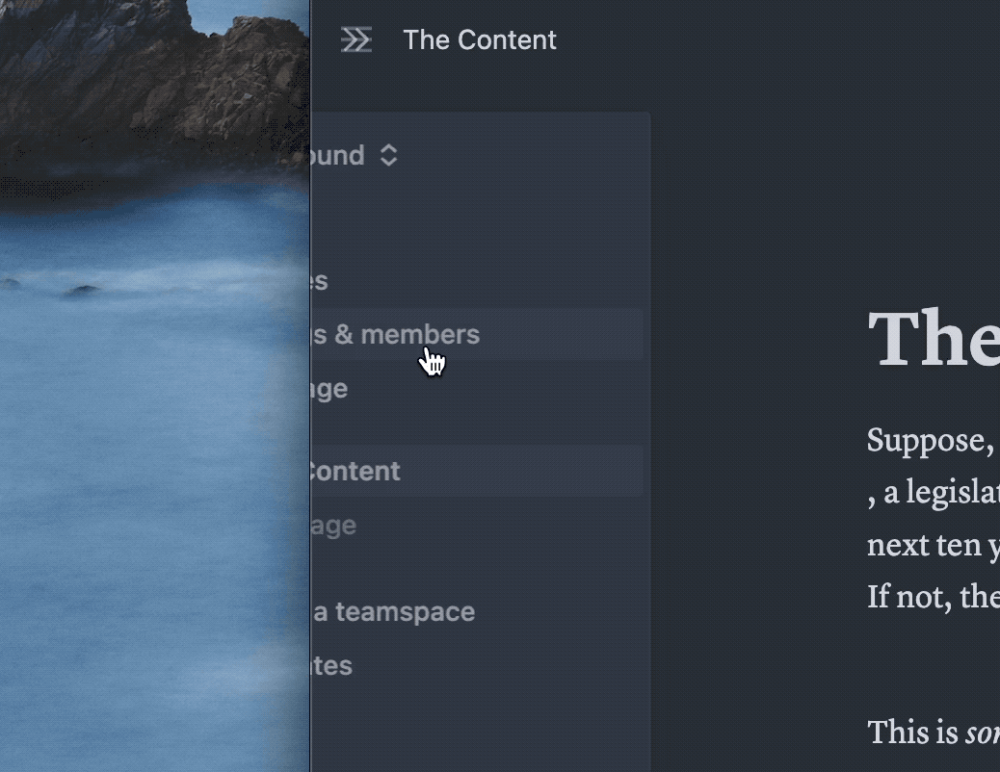
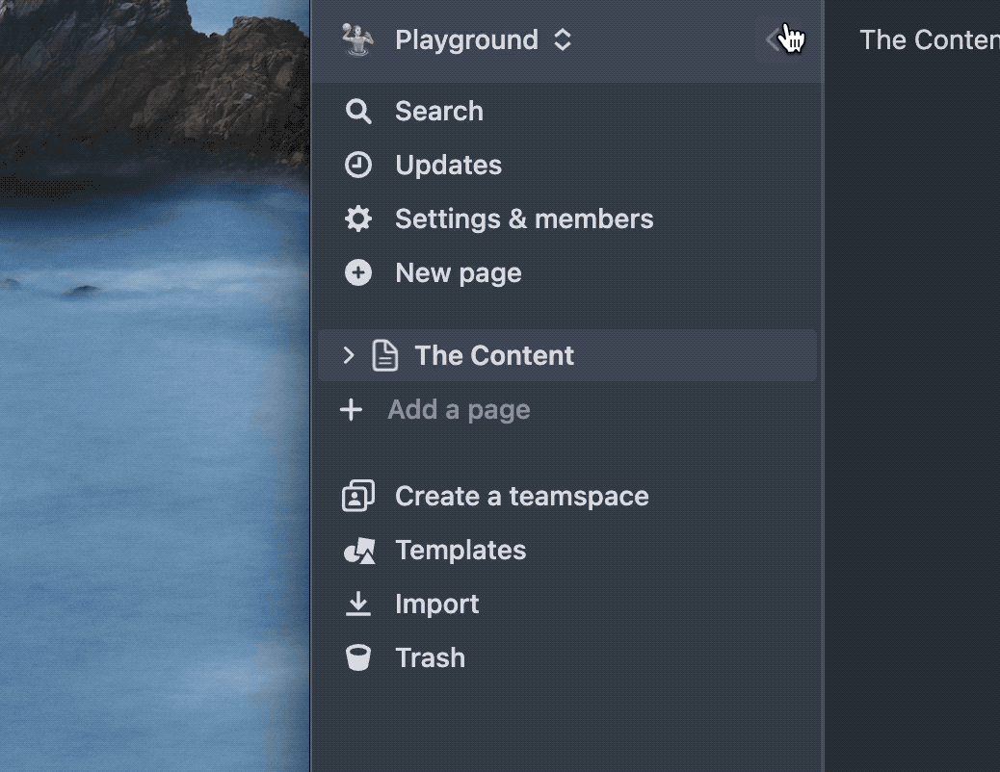

 
<h1 align="center"> readme</h1>

<h1 align="center">Notion Sidebar Tamer Userscript</h1>
Fork of chrome extension that disables the Notion sidebar appearing on hover to the userscript that can be used in Firefox-based (or Chrome-based) browsers. 
 

## Introduction

The sidebar in Notion is a great way to navigate between pages, but it can be distracting when you're working between windows. This Chrome extension disables the appearing on hover of the sidebar.

## Installation

Just install it via [Tampermonkey]([url](https://addons.mozilla.org/en-US/firefox/addon/tampermonkey/)) or other alternative. 

## Comparison

Before

After

